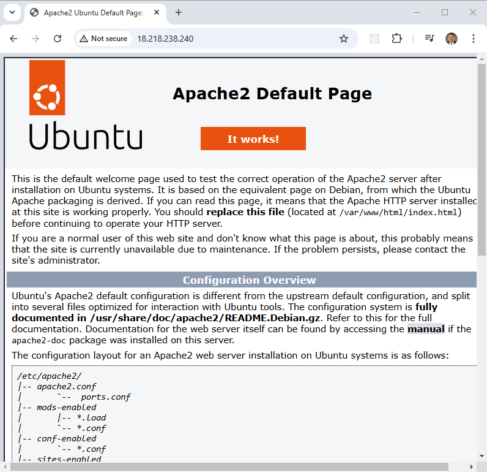

OCI Terraform Setup Instructions
=========================================

This project is a companion to a video on my channel on how to configure Terraform with Oracle Cloud Infrastructure (OCI).

The Terraform in this project creates a minimal VCN with one public subnet, a security list allowing SSH and HTTP, and a compute instance running Ubuntu 24.04. A [cloud-init script](scripts/userdata.sh) installs Apache when the instance boots.

## Download this Repository

```bash
git clone https://github.com/mamonaco1973/oci-setup.git
cd oci-setup
```

## Prerequisites

* [Install OCI CLI](https://docs.oracle.com/en-us/iaas/Content/API/SDKDocs/cliinstall.htm)
* [Install Latest Terraform](https://developer.hashicorp.com/terraform/install)
* [Install Latest Packer](https://developer.hashicorp.com/packer/install)

NOTE: Make sure the `oci`, `packer`, and `terraform` commands are all in your `$PATH`.

The [check_env](./check_env.sh) script validates this when you run the build.

## OCI Account Setup

You need an OCI account. The [OCI Free Tier](https://www.oracle.com/cloud/free/) (Always Free) works fine for this example.

### 1. Find Your Tenancy OCID

1. Log into the [OCI Console](https://cloud.oracle.com).
2. Click the **Profile** icon (top-right) → **Tenancy**.
3. Copy the **OCID** shown on the Tenancy detail page. Save it — you will need it later.

### 2. Create an API Signing Key

OCI uses API key-based authentication instead of username/password for CLI and Terraform access.

1. Click the **Profile** icon (top-right) → **My profile**.
2. Scroll down to **API keys** in the left menu and click it.
3. Click **Add API key**.
4. Select **Generate API key pair**.
5. Click **Download private key** — save the `.pem` file as `~/.oci/oci_api_key.pem`.
6. Click **Add**.
7. OCI will show you a **Configuration file preview** — copy the entire snippet. It looks like this:

```
[DEFAULT]
user=ocid1.user.oc1..aaaa...
fingerprint=xx:xx:xx:xx:xx:xx:xx:xx:xx:xx:xx:xx:xx:xx:xx:xx
tenancy=ocid1.tenancy.oc1..aaaa...
region=us-ashburn-1
key_file=~/.oci/oci_api_key.pem
```

### 3. Configure the OCI CLI

Create the config directory and paste the snippet:

```bash
mkdir -p ~/.oci
# Paste the snippet from step 7 above into this file
nano ~/.oci/config
```

Restrict permissions on both files (Linux/Mac only):

```bash
chmod 600 ~/.oci/config
chmod 600 ~/.oci/oci_api_key.pem
```

Verify the CLI works:

```bash
oci os ns get
```

You should see your Object Storage namespace returned as JSON. If this fails, double-check the `key_file` path in `~/.oci/config` and that the private key file exists there.

### 4. Get Your Compartment OCID

Everything in OCI lives in a **compartment**. The root compartment is your tenancy itself. For this example you can use the root compartment OCID (same as your Tenancy OCID from step 1), or create a dedicated compartment:

**Option A — Use the root compartment (simplest):**
Your compartment OCID is the same as your Tenancy OCID copied in step 1.

**Option B — Create a new compartment:**
1. In the OCI Console, open the navigation menu → **Identity & Security** → **Compartments**.
2. Click **Create Compartment**.
3. Give it a name (e.g., `terraform-demo`) and click **Create**.
4. Click the new compartment and copy its **OCID**.

### 5. Set the Compartment OCID Environment Variable

Terraform reads this variable automatically via the `TF_VAR_` prefix convention.

**Bash:**
```bash
export TF_VAR_compartment_ocid="ocid1.compartment.oc1..aaaa..."
```

**PowerShell:**
```powershell
$env:TF_VAR_compartment_ocid = "ocid1.compartment.oc1..aaaa..."
```

Add this to your shell profile (`.bashrc`, `.zshrc`, or PowerShell `$PROFILE`) to make it permanent.

## Generate SSH Keys

The instance is accessed via SSH key pair. Generate a new pair into the `keys/` directory:

```bash
ssh-keygen -t rsa -b 2048 -f ./keys/Private_Key -N ""
cp ./keys/Private_Key.pub ./keys/Public_Key
```

The public key is injected into the instance at launch. The private key stays local for SSH access.

## Run the "apply" Script

```bash
~/oci-setup$ ./apply.sh
NOTE: Validating that required commands are found in your PATH.
NOTE: oci is found in the current PATH.
NOTE: packer is found in the current PATH.
NOTE: terraform is found in the current PATH.
NOTE: All required commands are available.
NOTE: Checking TF_VAR_compartment_ocid environment variable.
NOTE: TF_VAR_compartment_ocid is set.
NOTE: Checking OCI CLI connection.
NOTE: Successfully connected to OCI.
Initializing the backend...
Initializing provider plugins...
- Finding oracle/oci versions matching "~> 6.0"...
- Installing oracle/oci v6.x.x...

Terraform has been successfully initialized!
[...]
```

## Test the Build

Once built, a single compute instance called `setup-instance` will be created and publicly accessible. Terraform outputs the public IP address.

SSH to the instance with the private key:

```bash
ssh -i ./keys/Private_Key ubuntu@<instance_public_ip>
```

Open a browser to `http://<instance_public_ip>` to confirm Apache is running. Apache installation runs on first boot via cloud-init — **allow up to 5 minutes** for it to complete.



## Run the "destroy" Script When You Are Done

```bash
~/oci-setup$ ./destroy.sh
```

This tears down all Terraform-managed resources. Always run this when finished to avoid unexpected charges.
